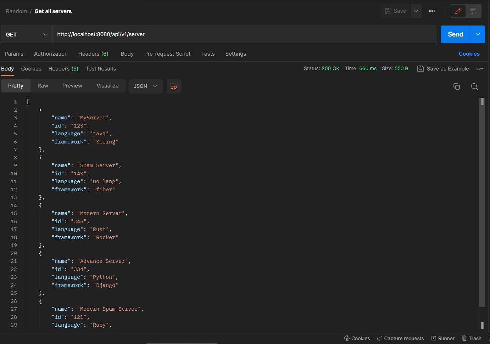
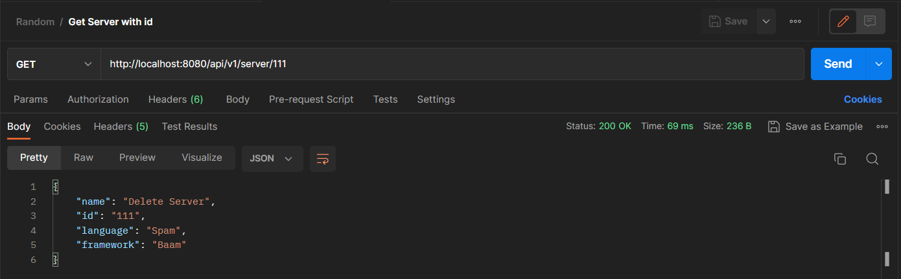
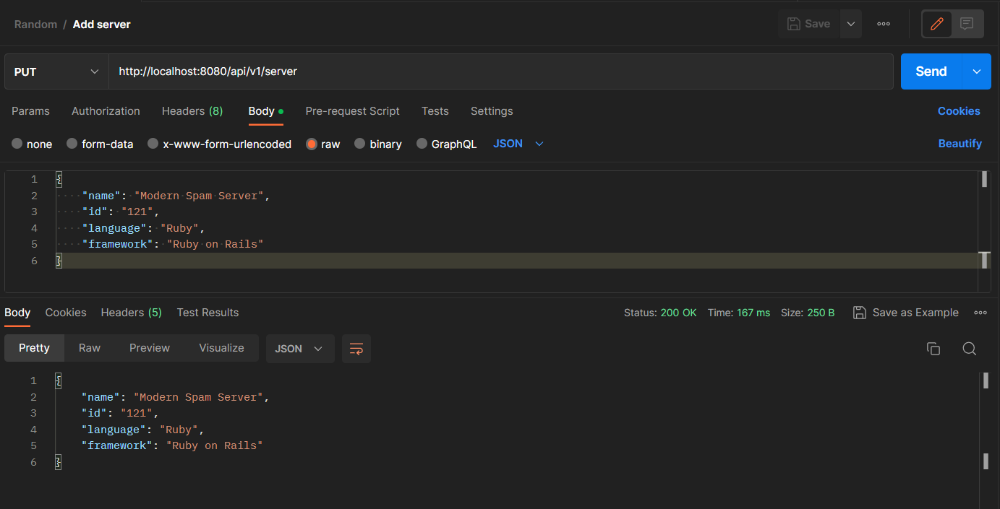
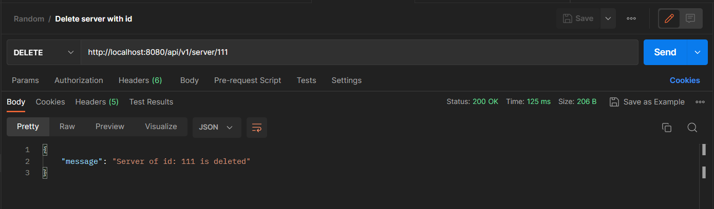
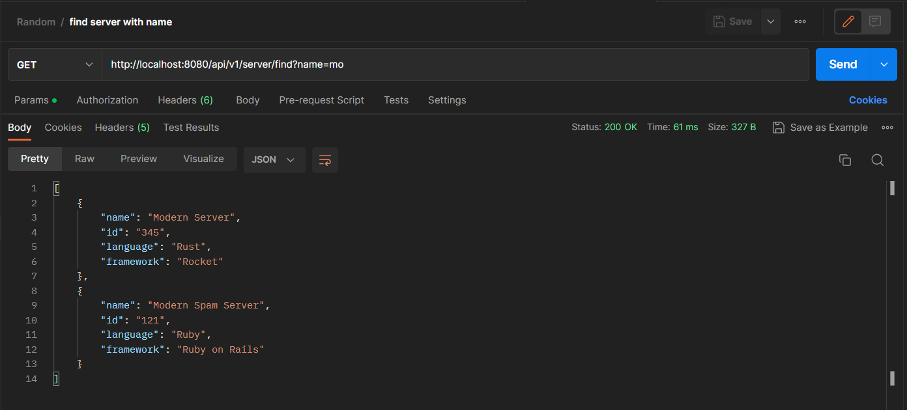

# Server Manager REST API
This is a Spring boot application written in java that provides a REST API for managing "server" objects using MongoDB as a database. It includes endpoints for searching, creating, updating, and deleting server objects.

## Installation
To run the application, you need to have the following software installed on your machine:

* Java 17 (if you don't have that then change the java version in pom.xml but please use java 8 or higher)
* Docker or mongoDBCompass for mongo db 

1. To install the application, follow these steps:
    ```bash
    git clone https://github.com/keima483/server-manager-rest-api.git
    ```

2. Open the project directory.
    ```bash
    cd server-manager
    ```
3. make a `.env` file as shown in the example `.env.example` and fill in the values
4. Start the application
   ```bash
   .\mvnw spring-boot:run
   ```

## Usage
The application provides the following REST API endpoints:

* `GET /api/v1/server`: Returns all servers if no parameters are passed. When server ID is passed as a parameter - returns a single server or 404 if there’s no such a server.
* `PUT /api/v1/server`: Creates a server object. The server object is passed as a JSON-encoded message body.
* `DELETE /api/v1/server/{id}`: Deletes a server object with the given ID.
* `GET /api/v1/server/find`: Searches for server objects by name. The parameter is a string. Must check if a server name contains this string and return one or more servers found. Return 404 if nothing is found.
<br>
<br>

To test the endpoints, you can use a tool like Postman or cURL to send HTTP requests to the API endpoints.

## Screenshots 
The screenshots of the Working of APIs are

1. Get All Servers
   
2. Get Server By ID
   
3. Add Or Update a Server
   
4. Delete A Server
   
5. Find Server by name
   
